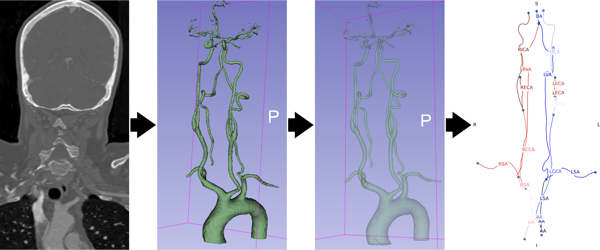
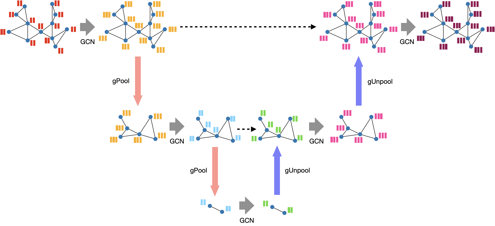

# Extracranial vessel labelling

This repository introduces a vessel labelling framework for a private dataset composed of 561 graphs, derived from stroke patients from Hospital Vall d'Hebron in Barcelona, Spain. Graphs themselves are created from extracting single centerline maps from vascular segemntations computed from full head-and-neck CTA images of patients suffering from acute ischemic stroke. Images are retrieved in the acute phase.



The goal is to develop an automatic, robust model for vessel labelling. To accomplish this, we performed a node classification task using a [Graph U-Net](https://arxiv.org/abs/1905.05178).



## Data description

The graph generation process is straight forward. Each bifurcaiton of the centerline maps corresponds to a node, while vascular segments are the edges connecting the bifuractions. Graphs are featurized using the [Arterial](https://www.sciencedirect.com/science/article/pii/S0895611122001409) framework. The main objective of this task was vessel labelling (*i.e.,* edge classification). However, we perform a [*node transform*](https://github.com/perecanals/EVC/blob/main/data/utils.py#L25) to convert this to a node classification task, to leverage the maturity of node classification GNNs in contrast with edge classification.

The segments were classified in one of 14 classes with anatomical meaning:

<table>
  <tr>
    <td>0: other</td>
    <td>7: RVA</td>
  </tr>
  <tr>
    <td>1: AA</td>
    <td>8: LVA</td>
  </tr>
  <tr>
    <td>2: BT</td>
    <td>9: RICA</td>
  </tr>
  <tr>
    <td>3: RCCA</td>
    <td>10: LICA</td>
  </tr>
  <tr>
    <td>4: LCCA</td>
    <td>11: RECA</td>
  </tr>
  <tr>
    <td>5: RSA</td>
    <td>12: LECA</td>
  </tr>
  <tr>
    <td>6: LSA</td>
    <td>13: BA</td>
  </tr>
</table>


### Data availability

Data can be made available on reasonable request.

## Usage

The intended use for this repo is to build a framework for training and testing of labelling algorithms for centerline graphs at a segment level. Currently, only one model was implemented and properly tested (the Graph U-Net). Fine tuning of this model was performed to find an optimal parameter combination. A total of 288 models were tested, combining parameters such as the batch size, number of hidden channels, depth of the Graph U-Net, data augmentation configuration, learning rate configuration... Default arguments of the main script include the parameter profile of the best-performing model.

By default, executing the main script will perform a training and testing of the model with the default parameter combination, allocating 20% of the data for testing and 20% of the remaining non-testing data for validation (no cross validation):

```bash
python main.py
```

Please, play around with the arguments of `main.py` to observe the possibilities of the repo.

### `root` directory

The code structure relies on the existence of a `root` directory. You should set it up as an environment variable, but we'll get into this for the installation instructions. This directory should contain:
* **raw_dir**: directory containing all raw data (raw graphs directly constructed from the centerline maps). Following the convention of Pytorch Geometric, this will be `root/raw`.
* **processed_dir**: the preprocessed data (after loading the data in the `EVCDataset` class) will be stored here. Following the convention of Pytorch Geometric, this will be `root/processed`.
* **dataset.json**: this document is crucial for adapting the repo to the task at hand. It is conceived a very generic way, so that relevant information at all levels (graph, nodes, edges) can be captured in the document to be retrieved later on. It is build from the dataset by the [generate_EVC_dataset_json](https://github.com/perecanals/EVC/blob/main/data/dataset.py#L226) function. It inputs several relevant arguments that, in combination with the data from the **raw_dir** can be used to store general descriptors of the data. By default, it is adapted to our private dataset from Vall d'Hebron. It will be stored at `root/dataset.json`
* **models**: directory where all the training runs and testing information will be stored (`root/models`). 

## Installation

The installation process is straight forward:

```bash
git clone https://github.com/perecanals/EVC.git
cd EVC
pip install -r requirements.txt
```

### Set up the `EVC_root` variable

Also, make sure to create an environment variable (`EVC_root`) with the path to your root directory. To do that, open your `~/.bashrc`/`~/.zshrc` (you can use a built-in editor like `nano` or if you are on Linux or MacOS you can just run `open ~/.bashrc`) file and add this line to the file:

```bash
export EVC_root="/path/to/your/root"
```

After adding the line to your `~/.bashrc` file, run the `source` command:

```bash
source ~/.bashrc
```

Now, you should be able to call the `EVC_root` environment variable with `os.environ["EVC_root"]` within Python.